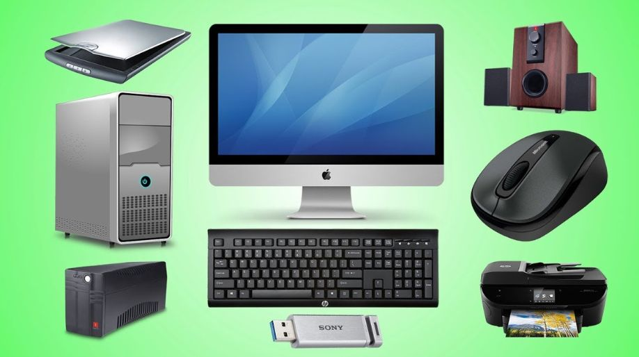

# **`What does it take place when we say Computers?`**

Whenever we see a computer we think of it as a normal machine.

We don't even think about its inner working like: what is happening inside of it? How does it process data? What happens when we give command to it? As a student we have to think like that. We should have all those answers and the inner working of it.

When we know their underlying concepts then we'll realise Oops! this is not what I was thinking. It is more than that. It is not just a machine which helps to do quality of work. It's like a _GIFT_ given by our top honorable scientists, Physicians, Mathematicians, Chemists.

I promise by the end of this course you'll realise Ooooo.... this is actually a gift given by really genius and great people.
