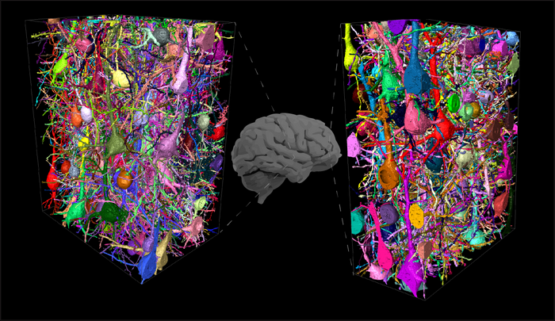
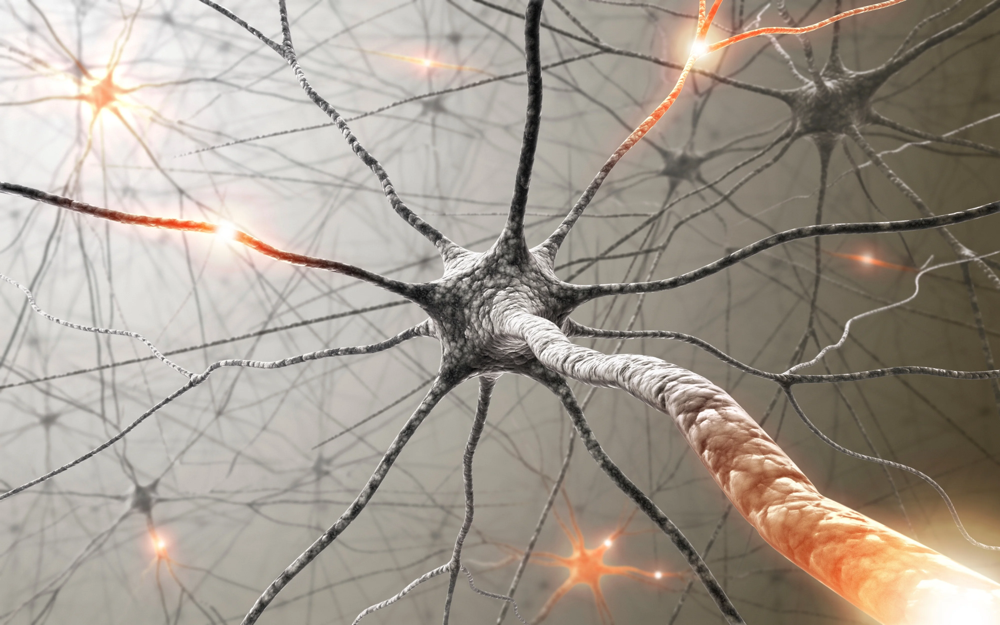
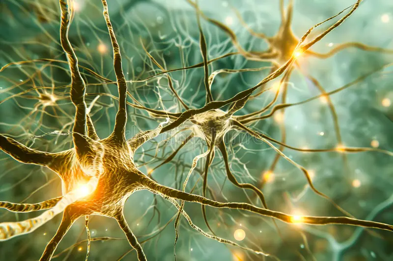

# **`What is a language? | Is language a code?`**

In short, Yes! Language is a Code.

How?

Lets have a look on this sentence :

کیسی ہو؟

Are you able to translate it without using any translator?

No, right?

Lets have a look on this another sentence :

kaip sekasi?

Are you?

Nooooooooooooo.

Now, I want to ask you something. What was the main reason you are not able to understand above sentences?

The sentence structure. Right? You don't even understanding their alphabets. So, how would you will be able to understand their meanings? Because there are no neural circuits that exist in our brain related to that specific alphabet and we don't even know the language's sentence structure.

Actual Answers :

کیسی ہو؟ = How are you?
kaip sekasi? = How are you?

## **`What are Neural Circuits?`**

Neural circuits are the connections between neurons in the brain that allow for communication and processing of information. They are responsible for our ability to learn, remember, and understand language, among other things. When we learn a new language, we are essentially creating new neural circuits in our brains that allow us to process and understand that language.

## **`What is a Neuron?`**

A neuron is a specialized cell in the nervous system that transmits information through electrical and chemical signals. Neurons are the building blocks of the brain and nervous system, and they play a crucial role in communication between different parts of the body. Each neuron consists of a cell body, dendrites, and an axon, which work together to send and receive signals.

## **`What is a Language?`**

Language is a system of communication that uses symbols, such as words or gestures, to convey meaning. It can be spoken, written, or signed, and it allows people to express their thoughts, feelings, and ideas. Language is also a code because it relies on a set of rules and conventions that govern how words and phrases are formed and used. This means that language is not just a random collection of sounds or symbols, but rather a structured system that allows for meaningful communication.

---

# **`भाषा क्या है? | क्या भाषा एक कोड है?`**

संक्षेप में, हाँ! भाषा एक कोड है।

कैसे?

आइए इस वाक्य पर एक नज़र डालें:

کیسی ہو؟

क्या आप बिना किसी अनुवादक का उपयोग किए इसका अनुवाद करने में सक्षम हैं?

नहीं, है न?

आइए इस दूसरे वाक्य पर एक नज़र डालें:

kaip sekasi?

क्या आप?

नहीं।

अब, मैं आपसे कुछ पूछना चाहता हूँ। मुख्य कारण क्या था कि आप उपरोक्त वाक्यों को समझने में सक्षम नहीं हैं?

वाक्य संरचना। है न? आप उनके अक्षर भी नहीं समझ पा रहे हैं। तो, आप उनके अर्थ कैसे समझ पाएँगे? क्योंकि हमारे मस्तिष्क में उस विशिष्ट वर्णमाला से संबंधित कोई तंत्रिका सर्किट मौजूद नहीं है और हम भाषा की वाक्य संरचना भी नहीं जानते हैं।

वास्तविक उत्तर :

क्या आप हैं = आप कैसे हैं?

कप सेकासी? = आप कैसे हैं?

## **`तंत्रिका सर्किट क्या हैं?`**

तंत्रिका सर्किट मस्तिष्क में न्यूरॉन्स के बीच कनेक्शन हैं जो संचार और सूचना के प्रसंस्करण की अनुमति देते हैं। वे अन्य चीजों के अलावा भाषा सीखने, याद रखने और समझने की हमारी क्षमता के लिए जिम्मेदार हैं। जब हम एक नई भाषा सीखते हैं, तो हम अनिवार्य रूप से अपने मस्तिष्क में नए तंत्रिका सर्किट बना रहे होते हैं जो हमें उस भाषा को संसाधित करने और समझने की अनुमति देते हैं।

## **`न्यूरॉन क्या है?`**

न्यूरॉन तंत्रिका तंत्र में एक विशेष कोशिका है जो विद्युत और रासायनिक संकेतों के माध्यम से सूचना प्रसारित करती है। न्यूरॉन मस्तिष्क और तंत्रिका तंत्र के निर्माण खंड हैं, और वे शरीर के विभिन्न भागों के बीच संचार में महत्वपूर्ण भूमिका निभाते हैं। प्रत्येक न्यूरॉन में एक कोशिका शरीर, डेंड्राइट और एक अक्षतंतु होते हैं, जो सिग्नल भेजने और प्राप्त करने के लिए एक साथ काम करते हैं।

## **`भाषा क्या है?`**

भाषा संचार की एक प्रणाली है जो अर्थ व्यक्त करने के लिए शब्दों या इशारों जैसे प्रतीकों का उपयोग करती है। इसे बोला, लिखा या हस्ताक्षरित किया जा सकता है, और यह लोगों को अपने विचारों, भावनाओं और विचारों को व्यक्त करने की अनुमति देता है। भाषा भी एक कोड है क्योंकि यह नियमों और परंपराओं के एक सेट पर निर्भर करती है जो यह नियंत्रित करते हैं कि शब्दों और वाक्यांशों का निर्माण और उपयोग कैसे किया जाता है। इसका मतलब है कि भाषा केवल ध्वनियों या प्रतीकों का एक यादृच्छिक संग्रह नहीं है, बल्कि एक संरचित प्रणाली है जो सार्थक संचार की अनुमति देती है।
